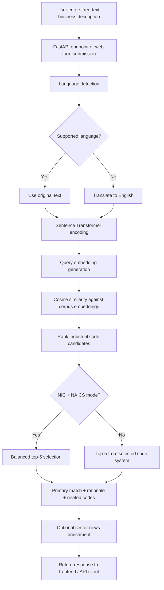

# 🏭 FreeText-to-Industrial-Code: Multilingual Semantic Search using Sentence Transformers

**FreeText to Industrial Code** is an AI-powered multilingual semantic search system that maps free-text business descriptions to industrial classification codes. Instead of relying on keyword matching, the system converts business descriptions into dense vector embeddings and retrieves the most relevant industrial codes using semantic similarity.

The platform supports multilingual queries and searches across both **NIC 2008** and **NAICS 2022** classification systems. For every query, it returns ranked industrial codes along with a **confidence score**, **similarity score**, **related codes**, and a short explanation of the match.

At its core, the system uses a **fine-tuned multilingual Sentence Transformer** model trained for industrial domain retrieval. The production application is built with **FastAPI** and a Jinja2-based frontend, exposing both an interactive web interface and REST-style API endpoints for classification workflows.

The repository also includes an offline embedding preparation script (`precompute_embeddings.py`) for generating semantic embeddings and preparing the retrieval corpus. The application is designed as a production-oriented FastAPI system with a responsive Jinja2-based web interface.

## 📌 Problem Statement

Industrial classification lookup is often performed using rigid keyword-based search or manual browsing of lengthy code catalogs. In practice, business users rarely describe their work using the exact terminology found in NIC or NAICS registries. They use free-form descriptions such as:

> "We manufacture battery packs for electric scooters and supply dealers."

Traditional lookup systems struggle when user intent is expressed in paraphrased, multilingual, incomplete, or domain-specific language. This creates friction in registration, compliance, analytics, and onboarding workflows where mapping business activity to the correct industrial code is essential.

## 🎯 Need for the Project

Keyword search is insufficient for industrial classification because exact token overlap is not a reliable signal of meaning. Two descriptions may represent the same activity while using different vocabulary, languages, or phrasing. Conversely, the same keyword may appear across multiple unrelated classifications.

This project uses **semantic search** to solve that gap. Instead of matching only literal words, it converts both the user query and industrial code descriptions into dense vector embeddings and ranks results using **cosine similarity**. This makes the system more robust for multilingual input, varied business phrasing, and real-world search behavior.

## ✅ Objectives

- Build a free-text industrial code search system for business activity descriptions.
- Support multilingual user input with automatic language detection.
- Retrieve top industrial code matches across **NIC** and **NAICS** datasets.
- Use semantic similarity instead of exact keyword matching.
- Expose the system through a usable web interface and API endpoints.
- Provide confidence, rationale, and related-code context for predictions.
- Capture user feedback for future model and product improvement.

## ✨ Key Features

- Free-text industrial code search
- Multilingual input handling
- Automatic language detection
- Translation fallback to English for embedding
- Semantic search using Sentence Transformers
- Top matching industrial codes with ranking
- Similarity score output
- Confidence score output
- Related industrial codes / neighbors
- Support for **NIC** and **NAICS**
- Balanced top-5 output for mixed NIC + NAICS mode
- Responsive single-page web interface
- Feedback capture via SQLite
- Optional sector news enrichment using SerpAPI

## 🧭 Project Architecture

At runtime, the FastAPI application loads a fine-tuned Sentence Transformer model and the `combined_codes.csv` dataset. During startup, the system prepares the code corpus by combining the title and description fields and computing embeddings for the full dataset.

When a user submits a business description, the application detects the language, translates unsupported languages to English when necessary, generates a query embedding, computes cosine similarity against the corpus embeddings, and returns the highest-scoring industrial codes. In combined mode, the top 5 results are balanced to include at least 2 NIC and 2 NAICS codes when available.



## 🗂️ Folder Structure

```text
FreeText-to-Industrial-Code/
├── api.py
├── app.py
├── precompute_embeddings.py
├── combined_codes.csv
├── requirements.txt
├── render.yaml
├── SERPAPI_SETUP.md
├── test_serpapi.py
├── README.md
├── .gitignore
├── image/
│   └── industry.png
├── static/
│   ├── app.js
│   └── styles.css
└── templates/
    └── index.html
```

> **Note:** Large model directories such as `fine_tuned_model_v3/` are intentionally excluded from GitHub due to file size limits. See [Model Availability](#-model-availability) for details.

## 🛠️ Technologies Used

| Category | Technologies |
|---|---|
| Backend | FastAPI, Uvicorn, Gunicorn |
| Frontend | HTML, CSS, JavaScript, Jinja2 Templates |
| Machine Learning | Sentence Transformers, PyTorch |
| NLP | Language Detection (`langdetect`), Translation (`deep-translator`) |
| Data Processing | Pandas, SQLite |
| Search / Similarity | Cosine similarity via `sentence_transformers.util` |
| Optional Enrichment | SerpAPI / Google News |
| Deployment | Render (`render.yaml`), Gunicorn with Uvicorn worker |

## 🤖 Machine Learning Pipeline

### Model Evolution

The model underwent multiple development iterations before reaching the final production version.

#### Version 1

**Base model:** `paraphrase-multilingual-MiniLM-L12-v2`

This version established the initial multilingual semantic retrieval baseline. MiniLM provided a lightweight starting point for sentence embeddings and early experimentation with industrial code matching.

#### Version 2

**Migrated to:** `paraphrase-multilingual-mpnet-base-v2`

The project migrated from MiniLM to MPNet to obtain better multilingual contextual embeddings and improved semantic understanding. This upgrade strengthened retrieval quality for paraphrased and cross-language business descriptions.

#### Version 3

The training dataset was expanded by combining:

- **NIC 2008**
- **NAICS 2022**
- Additional manually curated domain-specific multilingual business queries

This expansion improved industrial domain coverage and helped the model generalize across a wider range of business activity descriptions.

#### Version 4 (Final)

The MPNet model was fine-tuned using a two-stage training strategy:

| Stage | Loss Function | Purpose |
|---|---|---|
| Stage 1 | **Triplet Loss** | Learns to separate semantically similar and dissimilar industrial descriptions |
| Stage 2 | **Cosine Similarity Loss** | Refines embeddings so descriptions belonging to the same industrial code become closer in embedding space |

**Final production model:** `fine_tuned_model_v3`

### Why Triplet Loss?

Triplet Loss trains the model using an anchor, a positive example, and a negative example. This helps the system learn clearer separation between:

- industrial descriptions that belong to the same code family, and
- industrial descriptions that are semantically unrelated

As a result, the embedding space becomes more discriminative for industrial retrieval tasks.

### Why Cosine Similarity Loss?

Cosine Similarity Loss further refines the embedding geometry. After Triplet Loss establishes relative separation, Cosine Similarity Loss pulls matching industrial descriptions closer together in vector space. This improves ranking quality for top-1, top-3, and top-5 retrieval.

### Why MPNet Replaced MiniLM

MPNet replaced MiniLM for the following reasons:

- richer contextual embeddings
- better multilingual understanding
- stronger semantic similarity performance
- improved industrial code retrieval quality

While MiniLM was useful for early prototyping, MPNet provided a stronger foundation for production-grade multilingual semantic search.

### Retrieval Pipeline

1. Load `combined_codes.csv`
2. Merge `Title` and `Description` into a searchable text field
3. Encode every code description using the fine-tuned Sentence Transformer
4. Encode the user query
5. Compute cosine similarity between query embedding and corpus embeddings
6. Rank the results
7. Return the primary prediction, top suggestions, related codes, confidence score, and explanation

### Offline Embedding Workflow

The repository also contains `precompute_embeddings.py`, which can:

- preprocess the code dataset
- generate `corpus_embeddings.npy`
- export `processed_codes.csv`
- build a **FAISS** index (`faiss_index.bin`)

The main FastAPI application currently performs in-memory similarity using corpus embeddings. Offline FAISS preparation is available for future scalability improvements.

## 📊 Model Performance

Evaluation was performed on a held-out test set after fine-tuning. The final model achieved the following retrieval results:

| Metric | Score |
|---|---|
| Top-1 Accuracy | **94.60%** |
| Top-3 Accuracy | **99.68%** |
| Top-5 Accuracy | **99.68%** |

These results demonstrate the effectiveness of the proposed semantic search framework in accurately retrieving industrial classification codes from multilingual free-text business descriptions, even when the input contains paraphrased or domain-specific language.

These results indicate that the model retrieves the correct industrial code within the top prediction for the majority of test cases, and within the top 3 / top 5 results with very high reliability.

## 📦 Model Availability

The production model directory:

```text
fine_tuned_model_v3
```

is **not included in this GitHub repository** because the model size exceeds GitHub’s practical file size limit (~1 GB).

For local execution, the model must be placed in the project root. For cloud deployment, the model can be hosted externally (for example, on **Hugging Face**) and loaded during application startup.

## 🧾 Dataset

### Primary Datasets

The system is built on two industrial classification sources:

| Dataset | Description |
|---|---|
| **NIC 2008** | National Industrial Classification used for Indian industrial / economic activity coding |
| **NAICS 2022** | North American Industry Classification System used for US / Canada market and compliance contexts |

Both datasets are combined into a unified search corpus (`combined_codes.csv`) with the following fields:

- `Code`
- `Title`
- `Description`
- `Source`

### Dataset Enrichment

The dataset was enriched using **manually created domain-specific multilingual business descriptions** to improve semantic understanding and retrieval performance across different languages. This enrichment helped the model learn how real users describe industrial activities beyond the formal wording found in official code catalogs.

### How the Dataset Is Used

The application searches over the unified combined dataset and uses the `Source` field to:

- filter NIC-only results
- filter NAICS-only results
- balance mixed NIC + NAICS top-5 outputs

## 🔌 API Endpoints

The following FastAPI endpoints are available in `api.py`.

### `GET /`

**Purpose**  
Serves the main web interface.

**Request**  
No request body.

**Response**  
Returns rendered HTML from `templates/index.html`.

---

### `POST /classify`

**Purpose**  
Accepts a free-text business description and returns the best industrial code matches.

**Request Body**

```json
{
  "text": "We assemble solar panels and install rooftop systems for commercial buildings.",
  "language": "auto",
  "code_system": "both"
}
```

**Fields**

| Field | Description |
|---|---|
| `text` | Free-text business / activity description |
| `language` | Optional; supports `auto`, `en`, `hi`, `es`, `fr`, `de`, `zh-cn`, `ja` |
| `code_system` | Optional; `both`, `nic`, or `naics` |

**Response**

Returns:

- `top_code`
- `top_title`
- `top_description`
- `confidence`
- `similarity`
- `detected_language`
- `translated_query`
- `top_suggestions`
- `rationale`
- `neighbors`
- `timestamp`
- `sector_news`

---

### `GET /api/stats`

**Purpose**  
Returns code inventory statistics from the loaded dataset.

**Request**  
No request body.

**Response Example**

```json
{
  "total_codes": 3419,
  "nic_codes": 1297,
  "naics_codes": 2122
}
```

---

### `POST /feedback`

**Purpose**  
Stores user feedback for predictions in SQLite.

**Request Body**

```json
{
  "text": "Battery pack manufacturing for electric scooters",
  "rating": "correct",
  "model_top_code": "335911",
  "user_code": null,
  "comment": "Matched expected category"
}
```

**Response Example**

```json
{
  "status": "ok",
  "logged": true
}
```

## ☁️ Deployment

| Layer | Technology |
|---|---|
| Backend | FastAPI |
| Frontend | Jinja2 Templates |
| Static Assets | HTML, CSS, JavaScript |
| Deployment Target | Render |

The repository includes a `render.yaml` configuration for Render deployment using:

```bash
gunicorn -k uvicorn.workers.UvicornWorker api:api
```

**Current Status:** 🚧 Deployment to Render is currently in progress. A public live demo URL will be added once deployment is complete.

## ⚙️ Installation

### 1. Clone the repository

```bash
git clone https://github.com/Anushree-cod/FreeText-to-Industrial-Code.git
cd FreeText-to-Industrial-Code
```

### 2. Create a virtual environment

```bash
python -m venv .venv
```

**Windows activation**

```powershell
.\.venv\Scripts\Activate.ps1
```

**Linux / macOS activation**

```bash
source .venv/bin/activate
```

### 3. Install dependencies

```bash
pip install -r requirements.txt
```

### 4. Add the model locally

Place the production model directory in the project root:

```text
fine_tuned_model_v3/
```

Ensure `combined_codes.csv` is also present.

### 5. Run the FastAPI application

```bash
uvicorn api:api --reload
```

Open:

- `http://127.0.0.1:8000/`
- `http://127.0.0.1:8000/docs`

### 6. Optional: enable sector news

**Linux / macOS**

```bash
export SERPAPI_KEY="your_key_here"
```

**Windows PowerShell**

```powershell
$env:SERPAPI_KEY="your_key_here"
```

## 🖼️ Screenshots

Add screenshots here before publishing:

- `docs/screenshots/landing-page.png`
- `docs/screenshots/classification-results.png`
- `docs/screenshots/help-section.png`

Example Markdown:

```md


```

## 🚀 Future Scope

- Complete **Render** cloud deployment
- Host `fine_tuned_model_v3` on **Hugging Face** for external model loading
- Integrate a vector database such as **FAISS**, **ChromaDB**, or **Pinecone**
- Add OCR support for scanned business descriptions and registration documents
- Enable voice-based industrial search input
- Expand support to additional industrial classification systems
- Generate LLM-assisted explanations for industrial code predictions
- Build an admin dashboard for feedback analytics and model monitoring
- Extend the REST API for batch classification workflows

## 🤝 Contributing

Contributions are welcome. A recommended contribution workflow is:

1. Fork the repository
2. Create a feature branch
3. Make focused, well-documented changes
4. Test the application locally
5. Submit a pull request with a clear summary

Recommended contribution standards:

- Keep API changes backward compatible where possible
- Document architectural or ML changes clearly
- Avoid committing local virtual environments or large model artifacts
- Add screenshots or sample requests when UI / API behavior changes

## 📄 License

This project is intended to be distributed under the **MIT License**.

If a root `LICENSE` file is not yet present in the repository, add one before public release to make the licensing terms explicit.

## 🙏 Acknowledgements

This project builds on the following open-source tools and libraries:

- [FastAPI](https://fastapi.tiangolo.com/)
- [Sentence Transformers](https://www.sbert.net/)
- [PyTorch](https://pytorch.org/)
- [Pandas](https://pandas.pydata.org/)
- [Jinja2](https://jinja.palletsprojects.com/)
- [LangDetect](https://pypi.org/project/langdetect/)
- [deep-translator](https://pypi.org/project/deep-translator/)
- [FAISS](https://github.com/facebookresearch/faiss)
- [Render](https://render.com/)
